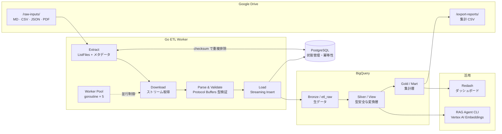

# go-drive-etl

Go の並行処理 + GCP (BigQuery) + Protocol Buffers で構成した、バッチ ETL データパイプライン。

Google Drive に置かれた業務ファイルを自動回収し、スキーマ検証を通して BigQuery へロードする。集計結果は Drive へ CSV レポートとして書き戻し、蓄積したテキストチャンクは RAG の検索対象として再利用する。

[](https://github.com/qei-2027-700/go-drive-etl/actions/workflows/ci.yml)
[](https://securityscorecards.dev/viewer/?uri=github.com/qei-2027-700/go-drive-etl)
[](go.mod)

---

## 3 分でわかる概要

| 問い | 答え |
|:---|:---|
| 何を解くのか | 非エンジニアが Drive に置く雑多なファイル（MD / CSV / JSON / PDF）を、人手を介さず分析可能な形へ落とし込む |
| なぜ Drive なのか | 現場との実運用インターフェースであり、「混沌とした外部ストレージからの回収」という実務課題をそのまま再現できる |
| 中心にある技術 | goroutine ベースの Worker Pool、Protocol Buffers によるスキーマ定義、PostgreSQL による冪等性の担保 |
| どこまで動くか | Drive → PostgreSQL → BigQuery の疎通は動作確認済み。通し実行のエントリポイント `cmd/worker` は実装中 |

---

## アーキテクチャ



### メダリオンアーキテクチャ

| Layer | Component | 役割 |
|:---|:---|:---|
| Bronze | BigQuery `etl_raw` | 取得した生データをそのまま永続化する |
| Silver | BigQuery View | Protocol Buffers 定義に沿った型安全な変換層。共通ロジックを View にカプセル化する |
| Gold | BigQuery Mart | 可視化・レポート配信のための最終集計層 |
| Metadata | PostgreSQL | 処理ステータス・チェックサム・リトライ回数のみを保持する。データ実体は持たない |

詳細な設計判断は [docs/architecture.md](docs/architecture.md) にまとめている。

---

## 設計上のポイント

### 1. Worker Pool による並行処理の制御

ファイル数に比例して goroutine を無制限に起動すると、Drive API のレートリミットと DB コネクションを容易に枯渇させる。バッファ付きチャネルをジョブキューとし、固定 5 並列のワーカーが取り出す形にしている。

```go
jobs := make(chan *domain.File, 100)

var wg sync.WaitGroup
for i := 0; i < 5; i++ {
    wg.Add(1)
    go func() {
        defer wg.Done()
        for {
            select {
            case file, ok := <-jobs:
                if !ok {
                    return
                }
                // ダウンロード → パース → ロード
            case <-ctx.Done():
                return
            }
        }
    }()
}
```

実装は [internal/etl/worker_pool.go](internal/etl/worker_pool.go)。

### 2. Graceful Shutdown

各ワーカーは `ctx.Done()` を select で監視する。`SIGTERM` 受信時は新規ジョブの取得を止め、`sync.WaitGroup` で処理中のジョブの完了を待ってから DB 接続を閉じる。ジョブ投入側も `ctx.Done()` を見ているため、キュー詰まりのままハングしない。

### 3. 冪等性

同じファイルを二重にロードしないよう、状態は PostgreSQL 側に寄せている。

- `drive_file_id` に UNIQUE 制約を張り、`Upsert` で再実行を吸収する
- Drive が返す `md5Checksum` を保存し、内容が変わっていないファイルは再処理しない
- ステータスは `pending → processing → done / failed` と遷移し、失敗したファイルだけを次回拾い直せる

スキーマは [migrations/001_init.sql](migrations/001_init.sql)。

### 4. Protocol Buffers によるスキーマ管理

パイプラインを流れるレコードの型は `.proto` を単一の情報源として定義し、Go の構造体を生成して使う。gRPC は使わず、スキーマ定義とバリデーションの用途に限定している。

```proto
message FileRecord {
  string drive_file_id = 1;
  string path = 2;
  string checksum = 3;
  string mime_type = 4;
  SyncStatus sync_status = 5;
  google.protobuf.Timestamp updated_at = 6;
}
```

定義は [proto/record.proto](proto/record.proto)、生成コードは `internal/pb/`。

### 5. テスト容易性

Drive / BigQuery / PostgreSQL の各クライアントはインターフェース越しに扱い、`mockgen` でモックを生成している（`make mock`）。外部サービスに接続せずに Worker Pool のロジックを検証できる。

### 6. インフラと CI

BigQuery のデータセットとテーブルは Terraform で定義し、手作業の構成変更を残さない（[iac/](iac/)）。CI では gofmt 検証・`go vet`・`govulncheck`・テストを実行し、Dependabot と OpenSSF Scorecard で依存とリポジトリ設定を継続的に監視している。

---

## 技術スタック

| カテゴリ | 技術 |
|:---|:---|
| 言語 | Go 1.26 |
| 並行処理 | goroutine / Worker Pool / `context.Context` |
| スキーマ管理 | Protocol Buffers |
| データソース | Google Drive API v3 (OAuth2) |
| DWH | BigQuery |
| 状態管理 DB | PostgreSQL 16 (Docker) |
| IaC | Terraform (Google Provider ~> 6.0) |
| テスト | `go test` / `mockgen` |
| CI/CD | GitHub Actions |
| セキュリティ | OpenSSF Scorecard / govulncheck / Dependabot |

---

## セットアップ

### 前提条件

- Go 1.26 以上
- Docker
- GCP プロジェクト（BigQuery API / Drive API 有効化済み）
- `gcloud` CLI

### 1. git フックの有効化

コミット時にステージ済みの Go ファイルへ自動で `gofmt` を適用する。`core.hooksPath` はリポジトリに含められないため、クローンごとに 1 度実行する。

```bash
git config core.hooksPath .githooks
```

`git add -p` で一部だけをステージしている場合は、ステージ外の変更を巻き込まないよう自動整形せずコミットを中止する。その場合は `gofmt -w <file>` を実行し、整形結果をステージし直す。

### 2. 認証情報の設定

```bash
cp .env.example .env
```

`.env` に以下を設定する。

| 変数 | 用途 |
|:---|:---|
| `GOOGLE_CLIENT_ID` / `GOOGLE_CLIENT_SECRET` / `GOOGLE_REFRESH_TOKEN` | Drive API の OAuth2 認証 |
| `BIGQUERY_PROJECT_ID` / `BIGQUERY_DATASET_ID` | ロード先の BigQuery |
| `DRIVE_FOLDER_ID` | 回収対象の Drive フォルダ |
| `POSTGRES_DSN` | 状態管理 DB への接続文字列 |

リフレッシュトークンは専用コマンドで取得する。

```bash
go run ./cmd/auth/
# 表示された URL をブラウザで開いて認証し、出力された値を GOOGLE_REFRESH_TOKEN に設定する
```

BigQuery は ADC で認証する。

```bash
gcloud auth application-default login
```

### 3. PostgreSQL の起動

```bash
docker compose up -d
docker compose exec -T postgres psql -U app -d app_db < migrations/001_init.sql
```

### 4. インフラの適用

```bash
cd iac
cp terraform.tfvars.example terraform.tfvars  # project_id などを設定
terraform init && terraform apply
```

---

## デモ

Drive → PostgreSQL → BigQuery の疎通を 1 コマンドで確認できる。

```bash
go run ./cmd/verify_drive/
```

```txt
Drive 取得ファイル数: 3

  ✓ PostgreSQL Upsert: 2026-W35-retrospective.md
  ✓ PostgreSQL Upsert: sales_2026q2.csv
  ✓ PostgreSQL Upsert: meeting-notes.pdf
  PostgreSQL pending 件数: 3

  ✓ BigQuery Insert: 3 件

--- Drive → PostgreSQL → BigQuery 疎通完了 ---
```

テストとモックの生成は Make 経由で行う。

```bash
go test ./...
make mock
```

> Redash ダッシュボードと RAG Agent CLI の実行例は、該当フェーズの実装完了後に追記する。

---

## ディレクトリ構成

```txt
go-drive-etl/
├── cmd/
│   ├── auth/           # OAuth2 リフレッシュトークン取得ツール
│   ├── verify_drive/   # Drive → PostgreSQL → BigQuery 疎通確認ツール
│   └── worker/         # ETL パイプライン本体（実装中）
├── internal/
│   ├── bq/             # BigQuery クライアント
│   ├── domain/         # ドメイン型定義
│   ├── drive/          # Google Drive クライアント
│   ├── etl/            # Worker Pool
│   ├── parser/         # ファイルパーサー（実装中）
│   ├── pb/             # Protocol Buffers 生成コード
│   └── repository/     # PostgreSQL リポジトリ
├── proto/              # Protocol Buffers 定義
├── migrations/         # DB マイグレーション SQL
├── iac/                # Terraform（BigQuery データセット / テーブル）
└── docs/               # アーキテクチャ・設計ドキュメント
```

---

## 実装状況

| 領域 | 状態 |
|:---|:---:|
| プロジェクト基盤 / PostgreSQL | ✅ |
| Protocol Buffers スキーマ定義 | ✅ |
| DB マイグレーション | ✅ |
| PostgreSQL Repository | ✅ |
| Google Drive クライアント | ✅ |
| Worker Pool（並行処理） | ✅ |
| BigQuery クライアント | ✅ |
| Terraform（BigQuery） | ✅ |
| CI / セキュリティ監視 | ✅ |
| ファイルパーサー（チャンク化） | 🚧 |
| ETL パイプライン統合（`cmd/worker`） | 🚧 |

進捗の内訳は [docs/progress.md](docs/progress.md) を参照。

---

## ロードマップ

| Phase | ゴール |
|:---|:---|
| Phase 1 | 任意のファイルを Drive から取り込み、チャンク単位で BigQuery に格納するまでを通しで動かす |
| Phase 2 | Vertex AI Embeddings と BigQuery Vector Search を用いた RAG Agent CLI を構築し、Recall / Faithfulness を計測する |
| Phase 3 | Gold 層を Redash で可視化し、集計 CSV を Drive へ自動デリバリーする |

---

## ドキュメント

| ファイル | 内容 |
|:---|:---|
| [docs/architecture.md](docs/architecture.md) | レイヤー設計・Worker の責務・ロードマップの詳細 |
| [docs/implementation-guide.md](docs/implementation-guide.md) | 実装手順 |
| [docs/local-development.md](docs/local-development.md) | ローカル開発環境 |
| [docs/security.md](docs/security.md) | セキュリティ方針 |
| [docs/progress.md](docs/progress.md) | フェーズ別の進捗 |
